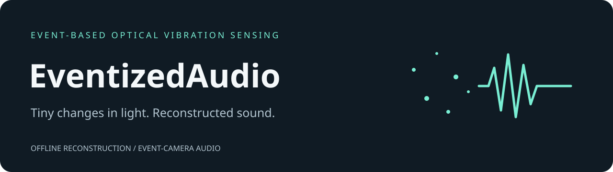
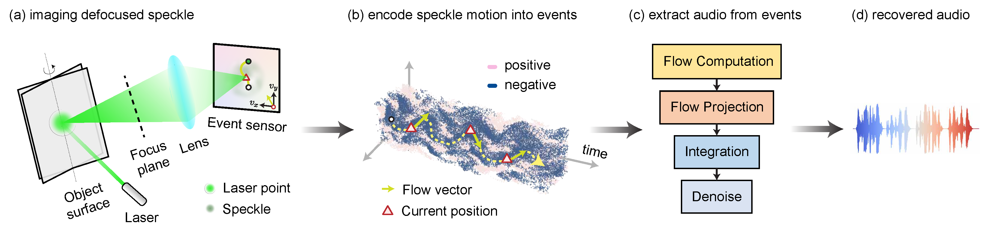

<p align="center"></p>

**Development history:** Developed locally before publication. These repositories were uploaded together, so their GitHub publication dates do not indicate when development began.

**Reconstruct sound from the small vibrations captured by an event camera.** EventizedAudio provides offline and online reconstruction pipelines, a single command-line entry point, and a reproducible Python environment.

[Research data](https://berkeley.box.com/s/4kdfmdx84xhot3145qkhnh1s2qg5w55e) · [Verification and limits](docs/verification.md)

## From events to audio

Event cameras report pixel-level brightness changes as a stream of events. The reconstruction uses this stream to measure fast motion in laser speckle patterns and reconstruct audio. Two paths are included: offline dense optical flow, and online time-gradient optical flow.



*Optical vibration sensing pipeline.*

## Set up

Use Python 3.12 in a virtual environment. The offline pipeline runs on CPU; a CUDA GPU is not required.

```bash
git clone https://github.com/nazeeh111/EventizedAudio.git
cd EventizedAudio
python3.12 -m venv .venv
source .venv/bin/activate
python -m pip install -r requirements.txt
```

For **online** processing, also install [Metavision SDK for Python](https://docs.prophesee.ai/4.6.2/index.html) in a supported environment. It provides `metavision_sdk_cv`; it is not included in the pip requirements. Offline processing does not need that SDK.

Download recordings and matching ground-truth audio from the [research dataset](https://berkeley.box.com/s/4kdfmdx84xhot3145qkhnh1s2qg5w55e). Recordings must be NumPy structured arrays containing `x`, `y`, `t` (microseconds), and `p` (0/1 polarity). Both algorithms require matching ground-truth audio for alignment and evaluation.

## Reconstruct a recording

Create the destination directory before processing:

```bash
mkdir -p Output
python eventized_audio.py offline --event_path EventRecordings/abespeech_chipbag.npy --gt_path GroundTruth/abespeech_gt.wav --out_path Output/abespeech_chipbag_hat_offline.wav
```

Use `online` in place of `offline` for the SDK-based method. For a folder:

```bash
python eventized_audio.py batch --event_dir EventRecordings --gt_dir GroundTruth --out_dir Output --mode offline
```

The existing `run_offline.py`, `run_online.py`, and `launch_runs.py` commands still work. `python eventized_audio.py --help` shows the new entry point; `python eventized_audio.py offline --help` shows the offline options once dependencies are installed.

The pipeline writes a 44.1 kHz WAV and a 16 kHz WAV whose filename includes PESQ and STOI speech-quality scores. It also writes a 16 kHz ground-truth WAV beside the input ground truth. Preserve your source data accordingly. Defaults, processing parameters, output naming, and side effects retain the existing computational behavior.

## Verification and limits

See [the verification record](docs/verification.md) for behavioral comparisons, the preserved processing interfaces, and environment limitations. Defaults, processing parameters, and WAV output behavior are preserved.

Batch processing validates input folders and matching ground-truth names, supports paths containing spaces, skips completed recordings, and stops with the child process exit code if reconstruction fails. Empty, degenerate, or malformed event arrays are not validated by the reconstruction algorithms.

Maintained by [nazeeh111](https://github.com/nazeeh111).

## License

Available under the [MIT license](LICENSE).
